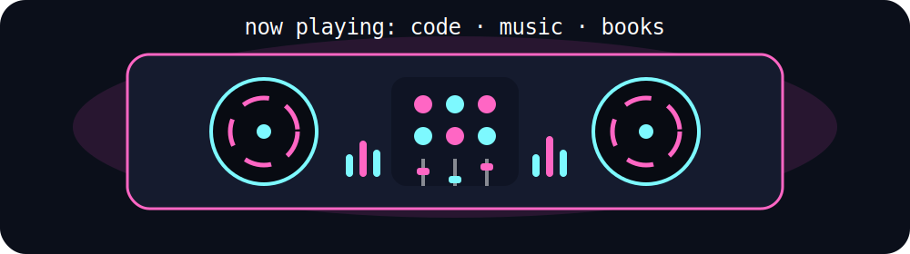

  

# Hi, I'm Trang  
Computer Science and Applied Mathematics @ Georgia State University  
Aspiring Data Scientist + Machine Learning Engineer  

---

## What I’m Into
- AI and machine learning  
- Backend engineering and scalable systems  
- Turning chaotic ideas into functional, production-style projects  

Currently exploring:
- FastAPI + backend architecture  
- SQL + data pipelines  
- Lightweight frontend frameworks  

---

## Tech Stack  

### Languages  

  
  

### Tools & Frameworks  

  

---

## Projects  

### Librorank (Book Recommendation System)  
A backend-driven recommendation system for managing and ranking books in a TBR list.  
- Built with FastAPI and Python  
- Designed for scalability and future ML integration  
- Focus on ranking logic and user-based recommendations  

---

### Sonic-Lab (Creative Coding / Audio Experiments)  
Exploring programmatic music inspired by live coding environments.  
- Experimenting with sound generation and structure  
- Blending code with creative output  

---

## GitHub Stats  

  

---

## Connect With Me  
- LinkedIn: https://www.linkedin.com/in/tranguyeenn/
- GitHub: https://github.com/tranguyeenn
- Email: tranguyeenn2007@gmail.com  

---

## Fun Fact  
Most of my projects start because I get bored… and then accidentally turn into something real
